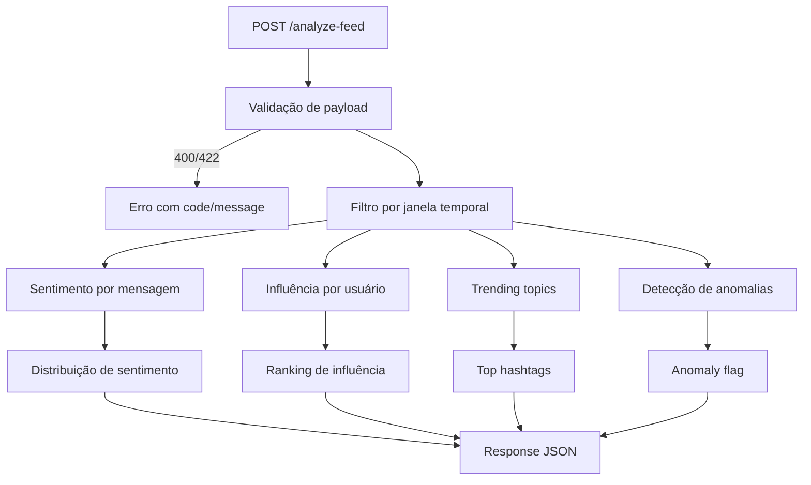

# 🚀 MBRAS — Sistema de Análise de Sentimentos

Este projeto implementa um **Sistema de Análise de Sentimentos em Tempo Real** que processa feeds de mensagens e calcula métricas de engajamento usando algoritmos determinísticos.

## 📋 O que foi entregue

1. **API implementada**: Endpoint `/analyze-feed` que processa mensagens
2. **Testes automatizados**: 6 casos obrigatórios + casos especiais
3. **Performance com meta definida**: alvo <200ms para 1000 mensagens e teste opcional
4. **CI configurado**: workflow com ao menos 3 etapas de check
5. **Repositório pronto para entrega**: publicação em GitHub

Pré-requisitos: Python 3.11+. Windows: `.venv\Scripts\activate`.

## 📡 API

- Endpoint: `POST /analyze-feed`
- Content-Type: `application/json`

Envie um `POST` para `/analyze-feed` usando o payload de `examples/sample_request.json`.

## 🗺️ Mapa do Fluxo (Mermaid)



## 🧠 Algoritmos Implementados

### Análise de Sentimento (Lexicon-Based)
- Lexicon interno: palavras positivas/negativas/intensificadoras/negações
- Ordem fixa: Tokenização → Intensificador (×1.5) → Negação (escopo 3 tokens) → Regra MBRAS (×2 positivos)
- Normalização: NFKD para matching, preserva acentos originais para contagem
- Classificação: `>0.1` = positive, `<-0.1` = negative, `[-0.1,0.1]` = neutral

### Influência de Usuários
- Followers simulados: SHA-256 determinístico do `user_id`
- Engagement rate: `(reactions + shares) / views` na janela temporal
- Ajuste Golden Ratio: interações múltiplas de 7 → `rate × (1 + 1/φ)`
- Score final: `(followers × 0.4) + (engagement × 0.6)`
- Penalidades: user_id terminando em "007" → ×0.5
- Bônus: funcionários MBRAS → +2.0

### Trending Topics
- Peso temporal: `1 + (1 / max(minutos_desde_postagem, 0.01))`
- Modificador de sentimento: positivo ×1.2, negativo ×0.8, neutro ×1.0
- Hashtags longas (>8 chars): fator logarítmico `log₁₀(len)/log₁₀(8)`
- Top 5 hashtags por soma de pesos
- Desempate: frequência bruta → peso de sentimento → ordem lexicográfica

### Detecção de Anomalias
- Burst: >10 mensagens do mesmo usuário em 5 minutos
- Alternância exata: padrão `+ - + -` em ≥10 mensagens por usuário
- Synchronized posting: ≥3 mensagens com timestamps dentro de ±2 segundos

## 🔍 Validações e Casos Especiais

### Validações de Input (400 Bad Request)
- `user_id`: regex `^user_[a-z0-9_]{3,}$` (case-insensitive)
- `content`: ≤ 280 caracteres Unicode
- `timestamp`: RFC 3339 com sufixo 'Z' obrigatório
- `hashtags`: array de strings iniciando com '#'
- `time_window_minutes`: > 0

### Regras de Negócio (422 Unprocessable Entity)
- `time_window_minutes == 123` → `{ "code": "UNSUPPORTED_TIME_WINDOW" }`

### Flags Especiais
- `mbras_employee`: `user_id` contém "mbras" (case-insensitive)
- `special_pattern`: content com exatos 42 chars Unicode + contém "mbras"
- `candidate_awareness`: content contém "teste técnico mbras"

### Casos Meta
- Mensagem "teste técnico mbras" → sentimento `meta` (excluída da distribuição)
- Se `candidate_awareness = true` → `engagement_score = 9.42`

## 🧪 Casos de Teste Obrigatórios

### Teste 1 — Básico
- Sentimento positivo detectado
- Trending topics populados

### Teste 2A — Erro de Janela
- `time_window_minutes = 123` → HTTP 422
- Código `UNSUPPORTED_TIME_WINDOW`

### Teste 2B — Flags Especiais  
- `mbras_employee = true`
- `candidate_awareness = true`
- `engagement_score = 9.42`

### Teste 3A — Intensificador Órfão
- Content "muito" → `sentiment_distribution.neutral = 100%`

### Teste 3B — Negação Dupla
- "não não gostei" → `sentiment_distribution.negative > 0`

### Teste 3C — Case Sensitivity MBRAS
- `user_MBRAS_007` → `mbras_employee = true`

## ⚡ Performance

**Alvos**
- < 200ms para 1000 mensagens
- ≤ 20MB memória para 10k mensagens

Para habilitar o teste de performance, execute o pytest com `RUN_PERF=1`.

## 📁 Estrutura do Projeto

```
projeto/
├── README.md
├── main.py
├── sentiment_analyzer.py
├── requirements.txt
├── tests/
│   ├── test_analyzer.py
│   └── test_performance.py
├── examples/
│   ├── sample_request.json
│   └── edge_cases.json
└── docs/
    ├── swagger.yaml
    └── algorithm_examples.md
```

## 🎯 Detalhes de Implementação Críticos

### Janela Temporal
- Referência: timestamp atual da requisição (UTC)
- Filtro: `timestamp >= (now_utc - time_window_minutes)`
- Tolerância: ignorar mensagens com `timestamp > now_utc + 5s`

### Tokenização Determinística
```
Input: "Não muito bom! #produto"
Tokens: ["Não", "muito", "bom", "#produto"]
Para lexicon: ["nao", "muito", "bom"] (normalizado NFKD, hashtag excluída)
Para cálculos: usar tokens originais
```

### Ordem de Precedência (Sentimento)
```
1. "Não muito bom" (usuário normal)
   → "bom" (+1) × intensificador (1.5) × negação (-1) = -1.5
   → Score: -1.5/3 = -0.5 → negative

2. "Super adorei!" (user_mbras_123)
   → "adorei" (+1) × intensificador (1.5) × MBRAS (2) = +3.0
   → Score: 3.0/2 = 1.5 → positive
```

### SHA-256 Determinístico
```python
followers = (int(hashlib.sha256(user_id.encode()).hexdigest(), 16) % 10000) + 100
```

Casos especiais:
- user_ids com Unicode precisam normalização NFKD antes do cálculo
- user_ids com exatos 13 caracteres seguem lógica diferente
- padrões específicos (ex: terminados em "_prime") têm regras especiais

## 🔒 Verificações de Qualidade

### Determinismo
- Mesmo input deve sempre produzir output idêntico
- SHA-256 sobre string exata do `user_id` (sem normalização)
- Timestamps processados consistentemente

### Atenção aos Detalhes
- `user_id "especialista"` sem "mbras" → `mbras_employee = false`
- Contagem Unicode para 42 caracteres (não bytes)
- Regex case-insensitive mas preservar case original
- Ordem fixa: Intensificador → Negação → MBRAS

## 💼 CI

### GitActions
- Workflow do GitHub Actions criado
- CI com ao menos 3 etapas de check
- Etapa de checagem de testes unitários incluída

## ✅ Checklist do que foi entregue

### Funcionalidade
- [x] Todos os 6 casos de teste passam
- [x] Endpoint HTTP funcional
- [x] Validações 400/422 implementadas
- [x] Função pura disponível para testes

### Performance
- [x] < 200ms para 1000 mensagens (opcional)
- [x] Uso de memória otimizado
- [x] Algoritmos O(n log n) ou melhor

### Qualidade
- [x] Código organizado e documentado
- [x] README com instruções claras (≤ 5 comandos)
- [x] Outputs determinísticos
- [x] Tratamento de edge cases

### Algoritmos
- [x] Tokenização/normalização NFKD
- [x] Janela temporal relativa ao timestamp da requisição
- [x] Ordem de precedência correta no sentimento
- [x] Flags MBRAS case-insensitive
- [x] Anomalias e trending implementados
- [x] SHA-256 determinístico para influência

### CI
- [x] Criação de um workflow do git actions
- [x] Criar um CI de ao menos 3 etapas

## 🎓 Como começar

### 1. **Preparar o ambiente**
```bash
python3 -m venv .venv && source .venv/bin/activate 
pip install -r requirements.txt
```

### 2. **Executar testes**
```bash
python -m pytest -v tests/test_analyzer.py
```

### 3. **Executar testes de performance**
```bash
RUN_PERF=1 python -m pytest -q tests/test_performance.py
```

### 4. **Rodar o servidor**
```bash
uvicorn main:app --host 0.0.0.0 --port 8000 --reload
```

### 5. **Testar o endpoint**
```bash
curl -X POST 'http://localhost:8000/analyze-feed' \
  -H 'Content-Type: application/json' \
  -d @examples/sample_request.json
```
